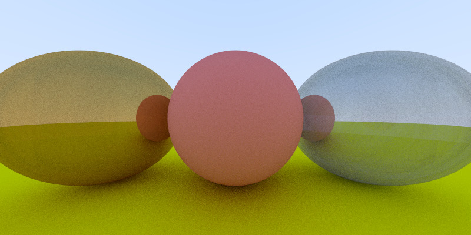

# rayml

A raytracer written in OCaml. It supports diffuse("matte") and
reflective("metallic") surfaces.

The design of the software roughly follows Peter Shirley's mini-book
series [Raytracing in One Weekend][weekend] which presents a raytracer
in C++. I've adopted the programming style to suit the OCaml's
functional style.

[weekend]: http://in1weekend.blogspot.com/2016/01/ray-tracing-in-one-weekend.html
